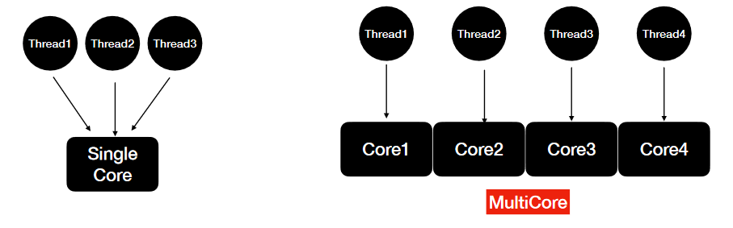
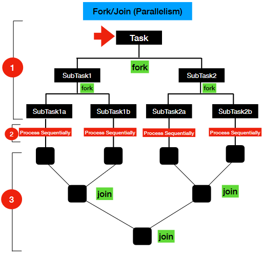

# `Java Multithreading: Parallelism and Asynchronous programming`

## **Evolution of Concurrency and Parallelism APIs in Java**

## **Concurrency vs Parallelism**

### Concurrency

* Concurrency is a concept where two or more task can run simultaneously
* In Java, Concurrency is achieved using **Threads**
* Are the tasks running in interleaved fashion?
* Are the tasks running simultaneously?

* **Issues:**
  - Race Conditions
  - DeadLocks and more

* **Tools to handle these issues:**
  - Synchronized Statements/Methods
  - Reentrant Locks, Semaphores
  - Concurrent Collections
  - Conditional Objects and More

### Parallelism

* Parallelism is a concept in which tasks are literally going to run in parallel (at the same time)

* Parallelism involves these steps:
  1. Decomposing the tasks in to SubTasks(Forking)
  2. Execute the subtasks in sequential
  3. Joining the results of the tasks(Join)
  
* Whole process is also called **Fork/Join**

