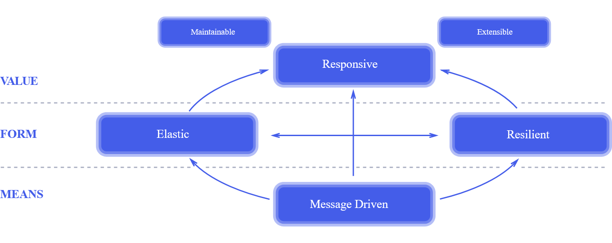

# `Java Multithreading: Parallelism and Asynchronous programming`

# Table of contents

- [**Evolution of Concurrency and Parallelism APIs in Java**](#evolution-of-concurrency-and-parallelism-apis-in-java)
- [**Concurrency vs Parallelism**](#concurrency-vs-parallelism)
  - [Concurrency](#concurrency)
  - [Parallelism](#parallelism)
- [**Threads, Future, ForkJoin, Executor and its limitations**](#threads-future-forkjoin-executor-and-its-limitations)
  - [Threads](#threads)
  - [Thread pool](#thread-pool)
  - [ExecutorService](#executorservice)
  - [ForkJoin Framework](#forkjoin-framework)
- [**Streams API & Parallel Streams**](#streams-api--parallel-streams)
  - [Streams API](#streams-api)
  - [ParallelStreams](#parallelstreams)
  - [Collect Vs Reduce](#collect-vs-reduce)
  - [Poor performance in parallel streams](#poor-performance-in-parallel-streams)
  - [Common ForkJoin Pool](#common-forkjoin-pool)
  - [Modifying  Default parallelism  in  Parallel Streams](#modifying--default-parallelism--in--parallel-streams)
- [**CompletableFuture**](#completablefuture)
  - [Reactive programming](#reactive-programming)
  - [Completable future important methods](#completable-future-important-methods)
  - [Combining independent Async Tasks](#combining-independent-async-tasks)
  - [thenApply() vs thenCompose():](#thenapply-vs-thencompose)
  - [Exception Handling In CompletableFuture](#exception-handling-in-completablefuture)
  - [CompletableFuture Default ThreadPool](#completablefuture-default-threadpool)
  - [Threads in CompletableFuture](#threads-in-completablefuture)
  - [Other useful methods](#other-useful-methods)
  - [Timeouts](#timeouts)
- [**References/Bibliography**](#referencesbibliography)

## **Evolution of Concurrency and Parallelism APIs in Java**


## **Concurrency vs Parallelism**

### Concurrency

* Concurrency is a concept where two or more task can run simultaneously
* In Java, Concurrency is achieved using **Threads**
* Are the tasks running in interleaved fashion?
* Are the tasks running simultaneously?


* **Issues:**
  - Race Conditions
  - DeadLocks and more

* **Tools to handle these issues:**
  - Synchronized Statements/Methods
  - Reentrant Locks, Semaphores
  - Concurrent Collections
  - Conditional Objects and More

### Parallelism

* Parallelism is a concept in which tasks are literally going to run in parallel (at the same time)

* Parallelism involves these steps:
  1. Decomposing the tasks in to SubTasks(Forking)
  2. Execute the subtasks in sequential
  3. Joining the results of the tasks(Join)
  
* Whole process is also called **Fork/Join**


## **Threads, Future, ForkJoin, Executor and its limitations**

Let's imagine the following service implemented:


### Threads

[Example of services with Threads](src/main/java/com/example/thread)

#### Thread API

* Threads API got introduced in Java 1
* Threads are basically used to offload the blocking tasks as background tasks
* Threads allowed the developers to write asynchronous style of code

#### Thread API limitations

* Requires a lot of code to introduce asynchrony
  - Runnable, Thread:
    * Requires additional properties in Runnable
    * Starts and Join the thread

* Low level
* **Easy to introduce complexity** in to our code

#### Limitations of Thread

* Create the thread
* Start the thread
* Join the thread
* Threads are expensive
* Threads have their own runtime-stack, memory, registers and more

**NOTE: Thread Pool was created specifically to solve these problems**

### Thread pool

* Thread Pool is a group of threads created and readily available
* CPU Intensive Tasks:
  - ThreadPool Size = No of Cores
* I/O task
  - ThreadPool Size > No of Cores
* What are the benefits of thread pool?
  - No need to manually create, start and join the threads
  - Achieving Concurrency in your application


### ExecutorService

ExecutorService is a JDK API that simplifies running tasks in asynchronous mode. Generally 
speaking, ExecutorService automatically provides a pool of threads and an API for assigning 
tasks to it.

* Released as part of Java 5
* ExecutorService in Java is an **Asynchronous Task Execution Engine**
* It provides a way to asynchronously execute tasks and provides the results in a much 
simpler way compared to threads
* This enabled coarse-grained task based parallelism in Java

The _submit()_ and _invokeAll()_ methods return an object or a collection of objects of type
_Future_, which allows us to get the result of a task's execution or to check the task's status
(is it running).

Simply put, the _Future_ class represents a future result of an **asynchronous computation**. 
This result will eventually appear in the future, after the processing is complete.


#### Limitations of ExecutorService

* Designed to Block the Thread
```java:
ProductInfo productInfo = productInfoFuture.get();
Review review = reviewFuture.get();
```

* No better way to combine futures
```java:
ProductInfo productInfo = productInfoFuture.get();
Review review = reviewFuture.get();
return new Product(productId, productInfo, review);
```

### ForkJoin Framework

* This got introduced as part of Java 7
* This is an extension of ExecutorService
* Fork/Join framework is designed to achieve **Data Parallelism**  
* ExecutorService is designed to achieve **Task-based Parallelism**
```java:
Future<ProductInfo> productInfoFuture = 
                        executorService.submit(() -> productInfoService.retrieveProductInfo(productId));
Future<Review> reviewFuture = 
                        executorService.submit(() -> reviewService.retrieveReviews(productId));
```

**Data Parallelism** is a concept where a given Task is recursively split into SubTasks until 
it reaches it the least possible size and execute those tasks in parallel. Basically it uses 
the divide and conquer approach.

The framework uses the ForkJoin pool to achieve Data Parallelism.


## **Streams API & Parallel Streams**

### Streams API

* Streams API got introduced in **Java 8**
* Streams API is used to process a collection of Objects
* Streams in Java are created by using the _stream()_ method

#### Sequential/Parallel  Functions  in  Streams API

* Streams API are sequential by default
* _sequential()_ -> Executes the stream in sequential
* _parallel()_ -> Executes the stream in parallel
* Both the functions changes the behavior of the whole pipeline

### ParallelStreams

* This allows your code to run in parallel
* ParallelStreams are designed to solve **Data Parallelism**
* ParallelStreams in Java are created by using the _parallelStream()_ method

#### How it works?

* _parallelStream()_:
  - **Split** the data in to chunks:
    * Data Source is split into small data chunks:
      - Example - **List Collection** split into chunks of elements to **size 1**
    * This is done using **Spliterators**
      - For ArrayList, the **Spliterator** is **ArrayListSpliterator**
  - **Execute** the data chunks
    * Data chunks are applied to the Stream Pipeline and the **Intermediate** operations 
    executed in a **Common ForkJoin Pool**
    * Watch out the [Fork/Join FrameWork](#forkjoin-framework) section
  - **Combine** the result
    * Combine the executed results into a final result
    * Combine phase in Streams API maps to **terminal** operations
    * Uses _collect()_ and _reduce()_ functions  
    * _collect(toList())_


#### Spliterators

* Data source is split into multiple chunks by the Spliterator
* Each and every collection has a different Spliterator Implementation
* Performance differ based on the implementation

**Recommendation:** 
Always compare the performance before you use _parallelStream()_

**Final computation result order:**

The order of the collection depends on:
  - Type of Collection  
  - Spliterator Implementation of the collection

Example : _ArrayList_
  - Type of Collection - **Ordered**
  - Spliterator Implementation - Ordered Spliterator Implementation

Example : _Set_
  - Type of Collection - **Unordered**
  - Spliterator Implementation - Unordered Spliterator Implementation

### Collect Vs Reduce

**Reduce** is a "fold" operation, it applies a binary operator
to each element in the stream where the first argument to the
operator is the return value of the previous application and the 
second argument is the current stream element.

**Collect** is an aggregation operation where a "collection" is
created and each element is "added" to that collection. Collections
in different parts of the stream are then added together.

#### Both of them:

* Part of Streams API
* Used as a terminal operation in Streams
API
* Produces a single result 

#### Collect:

* Result is produced in a mutable fashion
* Feature rich and used for many use cases

Example:
* _collect(toList()), collect(toSet())_
* _collect(summingDouble(Double::doubleValue));_

#### Reduce:

* Result is produced in an immutable fashion
* Reduce the computation into a single value

Example
* Sum -> _reduce(0.0, (x , y)->x+y)_
* Multiply -> _reduce(1.0, (x , y)->x * y)_

**Identity in Reduce:**
* Identity gives you the same value when it's used in the
computation:
  - Addition: Identity = 0
    * 0 + 1 => 1
    * 0 + 20 => 20
  - Multiplication : Identity = 1
    * 1 * 1 => 1
    * 1 * 20 => 20

**_reduce()_ is recommended for computations that are associative**

### Poor performance in parallel streams

Boxing and Unboxing operations makes a program to performance poorly

### Common ForkJoin Pool

Parallel Streams has a Common ForkJoin Pool as its execution engine.

* Common ForkJoin Pool is used by:
  - ParallelStreams
  - CompletableFuture
    * Completable Future have options to use a User-defined ThreadPools
  - Common ForkJoin Pool is shared by the whole process


### Modifying  Default parallelism  in  Parallel Streams

We can modify the default pool size for the ForkJoin with:

`System.setProperty("java.util.concurrent.ForkJoinPool.common.parallelism", "100");`

or

`-Djava.util.concurrent.ForkJoinPool.common.parallelism=100`

## **CompletableFuture**

* Introduced in Java 8
* CompletableFuture is an **Asynchronous Reactive Functional Programming API**
* Asynchronous Computations in a functional Style
* CompletableFutures API is created to solve the limitations of Future API

Completable future has:

* Factory Methods
* Initiate asynchronous computation
* Completion Stage Methods
* Chain asynchronous computation
* Exception Methods
* Handle Exceptions in an Asynchronous Computation

### Reactive programming

> Reactive Systems are:
>
> * **Responsive:** The system responds in a timely manner if at all possible. Responsiveness is the
> cornerstone of usability and utility, but more than that, responsiveness means that problems
> may be detected quickly and dealt with effectively. Responsive systems focus on providing rapid
> and consistent response times, establishing reliable upper bounds, so they deliver a consistent
> quality of service. This consistent behaviour in turn simplifies error handling, builds end 
> user confidence, and encourages further interaction.
>
> * **Resilient:** The system stays responsive in the face of failure. This applies not only to
> highly-available, mission-critical systems — any system that is not resilient will be 
> unresponsive after a failure. Resilience is achieved by replication, containment, isolation and 
> delegation. Failures are contained within each component, isolating components from each other 
> and thereby ensuring that parts of the system can fail and recover without compromising the 
> system as a whole. Recovery of each component is delegated to another (external) component and 
> high-availability is ensured by replication where necessary. The client of a component is not
> burdened with handling its failures.
>
> * **Elastic:** The system stays responsive under varying workload. Reactive Systems can react to
> change in the input rate by increasing or decreasing the resources allocated to service these 
> inputs. This implies designs that have no contention points or central bottlenecks, resulting in
> the ability to shard or replicate components and distribute inputs among them. Reactive Systems 
> support predictive, as well as Reactive, scaling algorithms by providing relevant live 
> performance measures. They achieve elasticity in a cost-effective way on commodity hardware and
> software platforms.
>
> * **Message Driven:** Reactive Systems rely on asynchronous message-passing to establish a boundary
> between components that ensures loose coupling, isolation and location transparency. This 
> boundary also provides the means to delegate failures as messages. Employing explicit 
> message-passing enables load management, elasticity, and flow control by shaping and monitoring
> the message queues in the system and applying back-pressure when necessary. Location
> transparent messaging as a means of communication makes it possible for the management of 
> failure to work with the same constructs and semantics across a cluster or within a single host.
> Non-blocking communication allows recipients to only consume resources while active, leading to
> less system overhead.
> --<cite>The Reactive Manifesto</cite>



### Completable future important methods

**supplyAsync()**

* FactoryMethod
* Initiates Asynchronous computation
* Input is Supplier Functional Interface
* Returns _**CompletableFuture\<T>**_

**thenAccept()**

* Completion Stage Method
* Chains Asynchronous Computation
* Input is **Consumer** Functional Interface
* Consumes the result of the previous  
* Returns _**CompletableFuture\<Void>**_
* Use it at the end of the Asynchronous computation

**thenApply()**

* Completion Stage method
* Transforms the data from one form to another
* Input is **Function** Functional Interface
* Returns _**CompletableFuture\<T>**_

### Combining independent Async Tasks

**thenCombine()**

* This is a Completion Stage Method
* Used to Combine Independent Completable Futures
* Takes two arguments: _CompletionStage_ & _BiFunction_
* Returns a CompletableFuture

**thenCompose()**

* Completion Stage method
* Transforms the data from one form to another
* Input is **Function** Functional Interface
* Deals with functions that return CompletableFuture
  - _thenApply_ deals with Function that returns a value
* Returns _CompletableFuture<T>_

### thenApply() vs thenCompose():

_thenApply_ is used if you have a **synchronous mapping** function.

```java:
CompletableFuture<Integer> future =
        CompletableFuture.supplyAsync(() -> 1)
                         .thenApply(x -> x+1);
```

_thenCompose_ is used if you have an **asynchronous mapping** function (i.e. one that returns a
CompletableFuture). It will then return a future with the result directly, rather than
a nested future.

```java:
CompletableFuture<Integer> future =
      CompletableFuture.supplyAsync(() -> 1)
                       .thenCompose(x -> CompletableFuture.supplyAsync(() -> x+1));
```


### Exception Handling In CompletableFuture

CompletableFuture API has functional style of handling exceptions

Three options available:

* Those who **Catch Exception and Recover**:

  - _handle()_
  - _exceptionally()_

* Those that **Catch Exception and does NOT Recover**:

  - _whenComplete()_
  - _whenHandle()_

**Using _handle()_:** 


**Using _exceptionally()_:** 


**Using _whenComplete()_:** 


### CompletableFuture Default ThreadPool

* By default, CompletableFuture uses the **Common ForkJoin Pool**
  - The no of threads in the pool == number of cores

#### CompletableFuture and user-defined ThreadPool using ExecutorService

**Why use a different ThreadPool?**

* Common ForkJoinPool is shared by
  - ParallelStreams
  - CompletableFuture
* It's common for applications to use ParallelStreams and CompletableFuture together
  - The following issues may occur:
    * Thread being blocked by a time-consuming task
    * Thread not available 

**Creating a user-defined ThreadPool**

```java:
Executors.newFixedThreadPool(Runtime.getRuntime().availableProcessors());
```

### Threads in CompletableFuture

#### Async() overloaded functions in CompletableFuture

Using _async()_ functions allows you to change the thread of execution; **use this when you 
have blocking operations in your _CompletableFuture_ pipeline**.

* Regular functions:
  - _thenAccept()_
  - _thenCombine()_
  - _thenApply()_
  - _thenCompose()_

* Async() overloaded Functions:
  - _thenAcceptAsync()_
  - _thenCombineAsync()_
  - _thenApplyAsync()_
  - _thenComposeAsync()_
  
### Other useful methods

**allOf()**

Dealing with Multiple CompletableFutures

* Static method that’s part of CompletableFuture API
* Use _allOf()_ when you are dealing with **Multiple CompletableFuture**


**anyOf()**

Dealing with Multiple CompletableFutures

* Static method that’s part of CompletableFuture API
* Use _anyOf()_ when you are dealing with retrieving **data from multiple Data Sources**


### Timeouts

* Asynchronous tasks may run indefinitely
* Used to time out a task in CompletableFuture
* _orTimeout()_ in CompletableFutureAPI
  
## **References/Bibliography**
  
> [1]
> «Multithreading,Parallel & Asynchronous Coding in Modern Java», Udemy. [Online]. Disponible
> en: https://www.udemy.com/course/parallel-and-asynchronous-programming-in-modern-java/. 
> [Accedido: 26-sep-2021]
